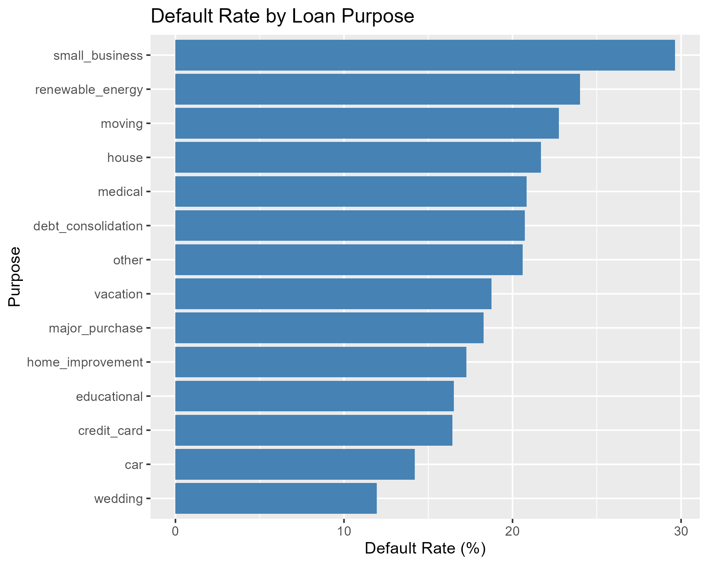
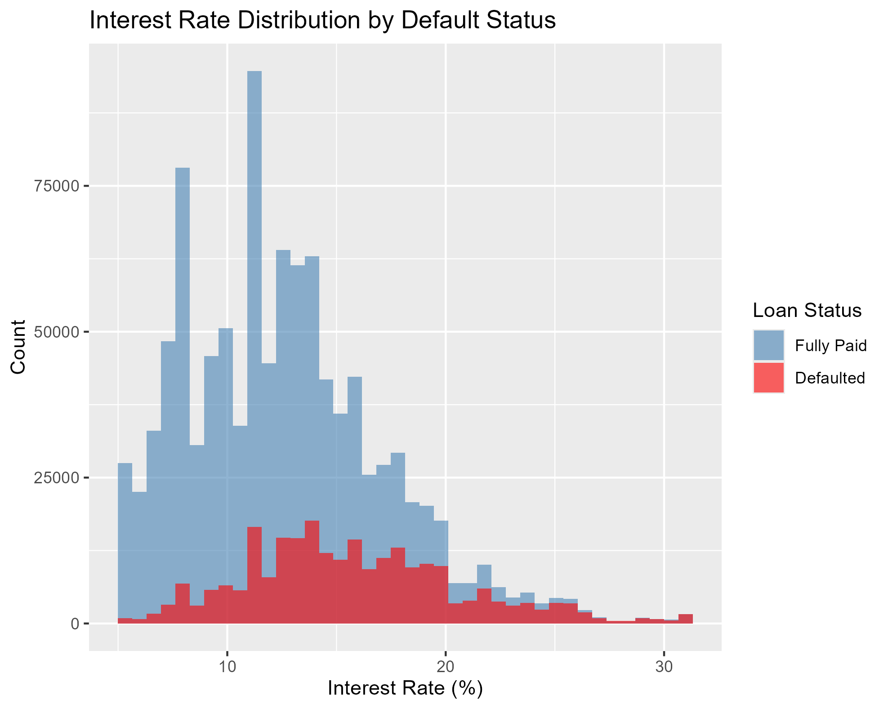
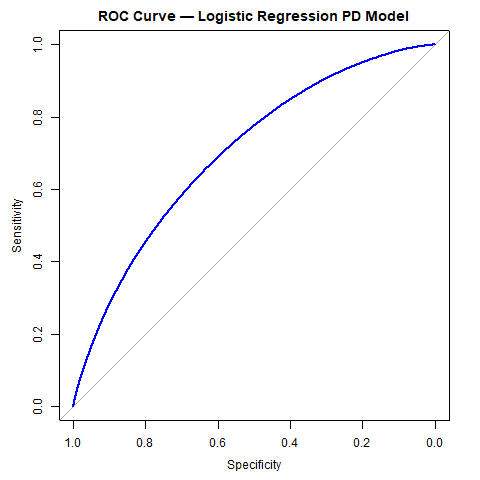
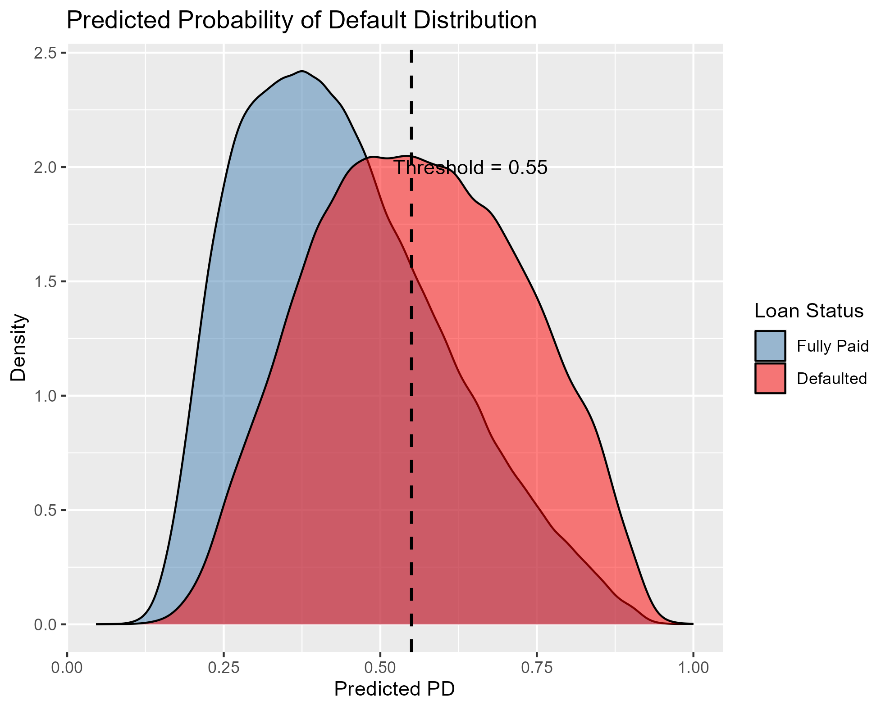
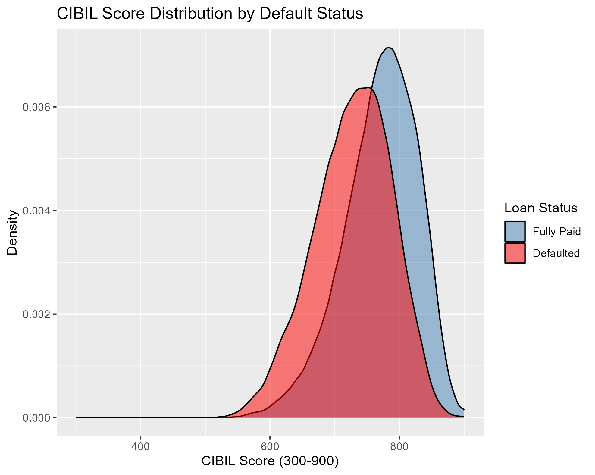
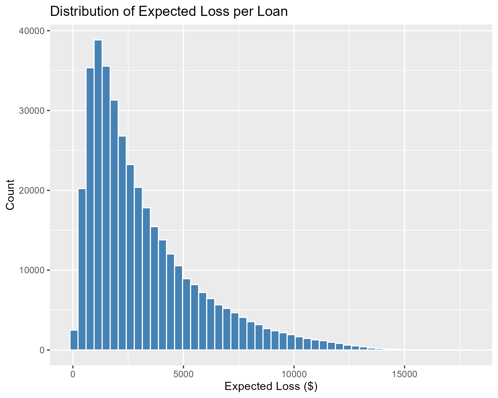

# Credit Risk Model — Probability of Default (PD)
### LendingClub Loan Data 2007–2018 | Actuarial Science Project

---

## Overview

This project builds a **Probability of Default (PD) model** for consumer loans using logistic regression. It is part of the Basel III credit risk framework, where banks are required to quantify the likelihood that a borrower will fail to repay their loan.

The core actuarial formula driving this project is:

**Expected Loss = PD × LGD × EAD**

- **PD** — Probability of Default *(estimated by this model)*
- **LGD** — Loss Given Default *(assumed at 45%, industry standard for unsecured loans)*
- **EAD** — Exposure at Default *(loan outstanding balance)*

Logistic regression is used because its output is naturally a probability between 0 and 1, it is fully interpretable, and it is the industry standard for PD modelling in banks — where regulatory bodies require explainable lending decisions.

---

## Data

**Source:** LendingClub Loan Data (2007–2018), available on [Kaggle](https://www.kaggle.com/datasets/wordsforthewise/lending-club)

**Size:** 1,266,010 loans after filtering for completed outcomes (Fully Paid, Charged Off, Default)

**Target Variable:** Binary — 1 if loan was Charged Off or Defaulted, 0 if Fully Paid

**Overall Default Rate: 19.53%** — the dataset is imbalanced, with 80% of loans fully paid.

---

## Variables Used

| Variable | Description | Effect on Default |
|---|---|---|
| loan_amnt | Loan amount ($) | Higher → more risk |
| term | Loan term (36 or 60 months) | 60 months → more risk |
| int_rate | Interest rate (%) | Higher → more risk |
| log_annual_inc | Log of annual income | Higher → less risk |
| dti | Debt-to-income ratio | Higher → more risk |
| emp_length | Years of employment | Longer → less risk |
| purpose | Purpose of loan | Varies by category |
| revol_util | Revolving credit utilisation % | Higher → more risk |
| open_acc | Number of open credit accounts | Higher → more risk |
| delinq_2yrs | Delinquencies in past 2 years | More → more risk |
| pub_rec | Public records (bankruptcies) | More → more risk |
| inq_last_6mths | Credit inquiries in last 6 months | More → more risk |

Annual income was log-transformed because it is heavily right-skewed. Adding 1 before taking the log avoids undefined values at zero income.

---

## Exploratory Data Analysis

Default rates vary meaningfully across loan purpose and term, confirming these are useful predictors. Small business loans have the highest default rate (29.6%), likely because small businesses are exposed to competitive market risk. Wedding loans have the lowest (11.9%), reflecting borrowers with stable financial planning. Longer term loans (60 months) default at more than double the rate of 36-month loans (32.1% vs 15.4%).

Higher interest rates are clearly associated with default — defaulted loans cluster at higher rates, consistent with lenders pricing in risk that subsequently materialised.

---

## Methodology

### Train / Test Split
The data was split 70% training (886,207 rows) and 30% test (379,803 rows).

### Handling Class Imbalance
The dataset is imbalanced — 80% fully paid, 20% defaulted. Without correction, the model learns to predict "fully paid" for almost every loan since that is statistically the safe guess. This is known as the **accuracy paradox** — a model that never predicts default can show 80% accuracy while being completely useless for risk management.

**Undersampling** was chosen over oversampling: fully paid loans in the training set were randomly reduced to match the number of defaulters (172,807 each), giving a balanced 50/50 training dataset of 345,614 rows. Undersampling was preferred because the dataset is large enough to afford discarding rows without losing model quality.

**The test data was kept imbalanced** to reflect real-world conditions.

### Model
A binomial logistic regression (GLM) was fitted on the balanced training data. All 24 coefficients are statistically significant (p < 0.05). The signs of all coefficients are economically intuitive — higher income reduces default probability, higher debt burden increases it.

---

## Results

### Model Performance

| Metric | Value |
|---|---|
| AUC | 0.7008 |
| Gini Coefficient | 0.4016 |
| Threshold Selected | 0.55 |
| Sensitivity at 0.55 | 0.757 |
| Specificity at 0.55 | 0.514 |

**AUC of 0.70** is considered acceptable in credit risk modelling. The Gini coefficient of 0.40 indicates the model has meaningful discriminatory power above random guessing (Gini = 0).

### ROC Curve

The ROC curve plots Sensitivity against 1-Specificity across all thresholds simultaneously. The area under this curve (AUC = 0.70) summarises the model's ability to rank defaulters above non-defaulters regardless of threshold choice.

### Threshold Selection

A threshold of **0.55** was selected — loans with predicted PD above 0.55 are classified as likely to default and rejected. This threshold was chosen to maximise loan approvals: a higher threshold means the model only rejects borrowers it is more confident will default, approving more borderline borrowers and generating greater interest income for the lender.

| Threshold | Accuracy | Sensitivity | Specificity |
|---|---|---|---|
| 0.40 | 0.5235 | 0.4531 | 0.8118 |
| 0.45 | 0.5981 | 0.5687 | 0.7184 |
| 0.50 | 0.6608 | 0.6718 | 0.6160 |
| **0.55** | **0.7094** | **0.7571** | **0.5141** |

Sensitivity and Specificity always trade off — a lower threshold catches more defaulters but also wrongly rejects more good borrowers. This is the same story the ROC curve tells, presented as a table.

### Predicted Probability Distribution

The two distributions overlap significantly, consistent with the AUC of 0.70. Fully paid loans (blue) peak around 0.30 while defaulted loans (red) peak around 0.55, showing the model is learning meaningful separation but not perfectly distinguishing the two groups. This is a known limitation of logistic regression on consumer loan data — further improvement could be achieved through more complex models such as decision trees, or by introducing interaction terms between key variables such as term and interest rate.

### CIBIL Score Distribution

Predicted probabilities were converted to a **CIBIL-style credit score (300–900)** using the log-odds transformation:

**CIBIL Score = 750 − 80 × log(PD / (1 − PD))**

This formula is conceptually identical to how real credit scoring systems work — the log-odds term is exactly the linear predictor from the GLM, rescaled into a human-readable range. Higher score means lower default risk.

| CIBIL Band | Risk | Decision |
|---|---|---|
| 750 – 900 | Excellent | Approved, best rates |
| 700 – 749 | Good | Approved |
| 650 – 699 | Fair | Approved with conditions |
| 600 – 649 | Poor | Likely rejected |
| 300 – 599 | Very Poor | Rejected |

Defaulted loans (red) are concentrated at lower CIBIL scores and fully paid loans (blue) at higher scores, confirming the scoring system is working as intended.

---

## Expected Loss Calculation

| Metric | Value |
|---|---|
| Total Portfolio Exposure | $5,546,496,225 |
| Total Expected Loss | $1,212,739,385 |
| EL as % of Portfolio | 21.86% |

Expected Loss is calculated as PD × LGD × EAD for each loan, where LGD = 45% is an industry standard assumption for unsecured personal loans. Note that Expected Loss depends on the raw predicted probability, not the binary threshold — changing the threshold affects loan approval decisions but does not change the portfolio-level expected loss estimate.

The distribution is right-skewed — most loans carry a relatively small expected loss, with a tail of higher-risk loans driving the portfolio total.

### Expected Loss vs Actual Loss

| Metric | Value |
|---|---|
| Total Expected Loss | $1,212,739,385 |
| Total Actual Loss | $532,420,369 |
| Difference | $680,319,017 |
| Ratio (EL / Actual) | 2.28 |

The model overestimates losses by a factor of 2.28 — meaning it is **prudent** in its risk assessment. While this provides a conservative safety buffer for the lender, the model could be refined to produce estimates closer to actual observed losses.

---

## Tools

R | data.table | dplyr | ggplot2 | caret | pROC

---

## Data Source

LendingClub Loan Data (2007–2018):
https://www.kaggle.com/datasets/wordsforthewise/lending-club
